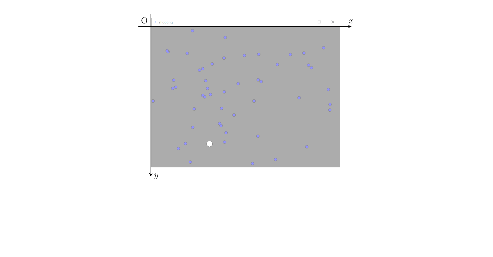

<!-- _class: title -->
# Processing 講習会

# 使用するもの

- **Processing** プログラミング言語の名前であり、開発環境の名前でもある。
  [ダウンロード先](https://processing.org/download) （バージョンは 4.0 でも 3.5.4 でもOK）
- [サンプルプログラム shooting.pde](https://drive.google.com/drive/folders/1OxtMl25cSQ5-Twdav7fAtkzKLNWT2V66?usp=sharing)
  避けゲーのサンプル

# 実行してみる

1. ファイルを開く。以下のどれでもOK。

   - Processing を起動して、`ファイル`>`開く` からダウンロードした`shooting.pde`を開く。

   - pdeファイルに Processing が関連付けられている場合は、`shooting.pde`をダブルクリック。

   - Processing を起動して`shooting.pde`をドラッグ＆ドロップでも一応動く（ただしスケッチブックの名前が変わってしまう）。

何かメッセージが出てきたときは`OK`とか`Get Started`みたいなボタンをクリック

2. ▶ ボタンをクリックして実行

# 今日やること

- プログラムと実際の挙動の対応を知る

# プログラムの原則

- 原則として上から順に処理されていく。
- 使えるのは基本的に半角文字。
- 変数名、関数名はアルファベット、数字、ハイフンだけで構成される。さらに数字は先頭に来られない。

# コメント in ソースコード

- `\\` より右側の部分には何を書いても機械には無視される。
- `/*`と`*/`で囲まれた部分も無視される。
- ソースコードを読む人間向けのメッセージ。
- 一目では分かりにくい処理、このようにプログラムを書いた理由、などを書く。
- **半年後の自分も他人。** 積極的にコメントを書こう。

# 変数は値を入れておく箱のようなもの。


```Java
（3行目）int BulletNumber = 50;
```


`int`：整数の値が入る箱を用意しろ、という意味（Integer の頭文字）。
`BulletNumber`：箱につける名前。自由につけられるが分かりやすいものが好まれる。
`=`：箱に値を入れろ、の意。
`50`：値。ちゃんと整数なので`int`と整合している。
`;`（セミコロン）は読点のようなもの。ここで1つの文が終わる。


# 変数は値を入れておく箱のようなもの。2

```Java
（8行目）float playerX = 320;
```

- `float`：実数の値が入る箱を用意しろ、の意（正確には浮動小数点数 floating point number）

- `320`：値。これは自動的に `320.0` と解釈されて箱に入れられる。

# 変数は値を入れておく箱のようなもの。3

```Java
（12行目）boolean gameover;
（25行目）gameover = false;
```

- `boolean`：真理値（`true`か`false`）が入る箱を用意しろ、の意。

- `int BulletNumber = 50;`も`int BulletNumber; BulletNumber=50;`と分けて書ける。

`（型名）（変数名）;`を**宣言**、`（変数名）=（値）;`を**代入**と呼ぶ。

変数の宣言だけしておいて代入は後から、というのも全然できる。
変数の宣言時に代入される値は**初期値**と呼んだりする。

# 配列は変数が並んだもの。

避けゲーで飛んでくる玉の数は50。でも50個の変数の宣言なんてしてられない。

```Java
（4行目）float[] bulletX, bulletY;//bullet position (x, y)
（18行目）bulletX = new float[BulletNumber];
（19行目）bulletY = new float[BulletNumber];
```

- `float[]`：float型の配列（の目印）を宣言。
- `bulletX, bulletY`：配列名。実は同じ型の変数を宣言するときは並べて書ける。
- `new float[BulletNumber]`：BulletNumber個（50個）のfloat型の箱を持ってくる。`bulletX`に代入することで、やっと`bulletX`が50個の箱を持つことになる。

# 配列は変数が並んだもの。2

```Java
（30行目）bulletX[i] = random(0, 640);
```
- `配列名[整数]`で配列の`整数`番目の要素にアクセス（値を代入したり取り出したり）できる。
- 順番は`0`から数え始めることに注意。たとえば`bulletX`は50個の要素を持っているので、`bulletX[0]`が最初の要素で、`bulletX[49]`が最後の要素になる。アクセス時に`bulletX[50]`などと指定してしまうとエラーになる。


# 小改変でプログラムとゲームの挙動の関連を確かめる

- `BulletNumber`の初期値を`100`とか`1000`にしてみると？
- `bulletR`（敵の半径）を変えると？

**その他の変数：**

- `playerX`, `playerY`：自機の$\hspace{0.2em}x, y\hspace{0.2em}$座標
- `playerR`：自機の半径
- `gameover`：ゲームオーバー時に`true`になるフラグ
- `bulletX[i]`,`bulletY[i]`：`i`番目の敵の$\hspace{0.2em}x, y\hspace{0.2em}$座標
- `bulletVy[i]`：`i`番目の敵の$\hspace{0.2em}y\hspace{0.2em}$方向の速さ

# 関数はひとまとまりの処理。

基本的には、数学と同じく入力（**引数**）に対して出力（**返り値**、**戻り値**）を返すもの。

ただ、関数の「処理をまとめる」という機能だけを利用した「何も入力を受け取らず、値も返さない関数」もよく使う。

# 関数はひとまとまりの処理。2

```Java
（14行目）void setup(){
            ...
（27行目）}
```
- `void`：返す値の型を表す。ここでは`void`すなわち「空っぽ」が指定されているので何も返さない。

- `setup`：関数名。自由につけられる（が、実は...）。

- `()`：引数を指定する場所。ここでは何も指定されていない。

- `{...}`：囲まれた部分に`setup`関数の処理が書かれている。

# Processing の特殊事情

決まった名前で関数を宣言しておくと、Processing のシステムから決まったタイミングで呼び出される。

- `setup`：プログラム開始時に呼び出される。
- `draw`：毎フレーム（60fpsなら1/60秒ごとに1回）呼び出される。主に描画処理が書き込まれる。
- `mousePressed`：右クリックや左クリック時に呼び出される。

また、決まった名前の変数に Processing のシステムから勝手に値が代入される。

- `mouseX`：マウスカーソルの$\hspace{0.2em}x\hspace{0.2em}$座標が代入される。

# 関数はひとまとまりの処理。3

宣言した関数はもちろん呼び出したいもの。

```Java
（29行目）void resetBullet(int i) {
                ...
（33行目）}
（43行目）      resetBullet(i);
```

`関数名(引数)`で呼び出せる。なお、ここでは関数宣言時の引数（**仮引数**）の名前`i`と呼び出し時に渡している変数名`i`がたまたま一致しているが、同じ名前じゃないといけないなんてことは全くない。

# 関数はひとまとまりの処理。4

Processing のシステムが用意した関数を呼び出すこともできる。

```Java
（15行目）size(640, 480);//set window size
```
`size`はウィンドウサイズを調整してくれる関数で、ウィンドウのサイズを横 `640px`、縦 `480px`にしろ、の意味になる。

```Java
（30行目）bulletX[i] = random(0, 640);
```
`random`は乱数を発生させる関数で、ここでは`0`以上`640`未満の実数をランダムに返せ、の意味になる。返された値を配列`bulletX`の`i`番目に代入している。

# 何度でも繰り返す。`for`文で。

```Java
for (int i = 0; i < 繰り返す回数; i++) {
    処理
}
```
のように書くと、`処理`が`繰り返す回数`回繰り返される。
（詳しく言うと、最初`i=0`に初期化され、1回`処理`を行うごとに`i++`が実行されて`i`が1増え、`i < 繰り返す回数`が満たされなくなると`for`文を抜ける。）

具体例

```Java
（22行目）for(int i = 0; i < BulletNumber; i++){//initialize bullet
（23行目）  resetBullet(i);
（24行目）}
```

# ウィンドウ上の座標



# `resetBullet` 名前の通り。

```Java
void resetBullet(int i) {
  bulletX[i] = random(0, 640);
  bulletY[i] = 0;
  bulletVy[i] = random(0.8, 4.0);
}
```

`i`番目の敵の位置をリセット。

# 文字列、`println`

```Processing
（26行目）println("GameStart!");
```

- 文字列は`"`（ダブルクオーテーション）で囲む。
- `println`：文字列などを**コンソール**に出力する。デバッグなどでよく使う。

# `setup` の流れ

1. ウィンドウサイズを調整。
1. 配列に実体を与える。
1. `for`文で全ての敵の位置をリセット。
1. `gameover`を`false`に（ゲーム開始時はゲームオーバーではないので）。
1. コンソールに`GameStart!`と出力。

# 条件分岐

```Java
if (条件) {
  処理1
} else {
  処理2
}
```
`条件`の部分にはboolean型の値が来る。`true`なら`処理1`が実行され、`false`なら`処理2`が実行される。選ばれなかった方の処理は実行されない。

# 比較演算子

**比較演算子** は、2つの数の大小を比較して`true`や`false`を返す演算子。

- `==` は値が等しければ`true`となり、そうでなければ`false`となる。`1==1`は`true`。ちなみに`=`は代入の役割しかもたないので条件を書くべきところに書くとエラーになる。

- `<`：未満。
- `<=`：以下。
- `>`：より大きい。
- `>=`：以上。

# 比較演算子2

```Java
int a = 1, b = 2;

if (a == b) {
  println("a is equal to b."); // 実行されない。
}
if (a < b) {
  println("a is less than b."); // 実行される。
}
if (a <= b) {
  println("a is b or less."); // 実行される。
}
```

# 否定演算子

`!`をつけると`true`は`false`に、`false`は`true`になる。
```Java
（36行目）if(!gameover){ //update characters' state
              ...
（55行目）}//!gameover
```
`gameover`が`true`ならこの中身は無視され、`false`なら実行される。

# inside `if(!gameover)`

1. 全ての敵の位置に速度を加算。敵がその速度で動くことになる。
   - `+=` は足して代入する、の意。`bulletY[i] = bulletY[i] + bulletVy[i];`と同じ。
1. 敵が画面外に行く（$\hspace{0.2em}y\hspace{0.2em}$座標が$480$を超える）とその敵の位置をリセットする。
1. 敵のいずれかと自機が衝突していたら（後述）ゲームオーバーにする。
1. 自機の$\hspace{0.2em}x\hspace{0.2em}$座標をマウスカーソルの位置に更新する。

# 衝突判定（衝突しない）


# 衝突判定（衝突する）


# 注意

- 具体的な文法については、Processing 依存のものが多い（C, Javaでも成り立つものも多い。Python はまた全然違うように見えるが、具体的な記法が違うだけでやってることは同じ。）


