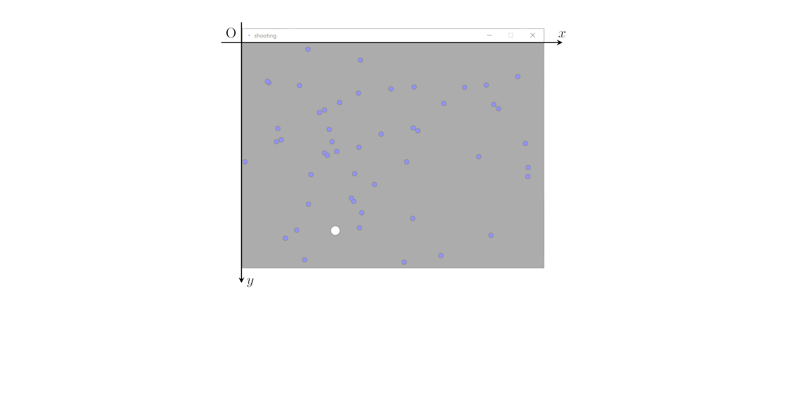

<!-- _class: title -->
# Processing 講習会

# 使用するもの

- **Processing** プログラミング言語の名前であり、開発環境の名前でもある。
  [ダウンロード先](https://processing.org/download) （バージョンは 4.0 でも 3.5.4 でもOK）
- [サンプルプログラム shooting.pde](https://drive.google.com/drive/folders/1OxtMl25cSQ5-Twdav7fAtkzKLNWT2V66?usp=sharing)
  避けゲーのサンプル

# 実行してみる

1. ファイルを開く。以下のどれでもOK。

   - Processing を起動して、`ファイル`>`開く` からダウンロードした`shooting.pde`を開く。

   - pdeファイルに Processing が関連付けられている場合は、`shooting.pde`をダブルクリック。

   - Processing を起動して`shooting.pde`をドラッグ＆ドロップでも一応動く（ただしスケッチブックの名前が変わってしまう）。

何かメッセージが出てきたときは`OK`とか`Get Started`みたいなボタンをクリック

2. ▶ ボタンをクリックして実行

# 今日やること

- プログラムと実際の挙動の対応を知る

# プログラムの原則

- 原則として上から順に処理されていく。
- 使えるのは基本的に半角文字。
- 変数名、関数名はアルファベット、数字、ハイフンだけで構成される。さらに数字は先頭に来られない。

# コメント in ソースコード

- `\\` より右側の部分には何を書いても機械には無視される。
- `/*`と`*/`で囲まれた部分も無視される。
- ソースコードを読む人間向けのメッセージ。
- 一目では分かりにくい処理、このようにプログラムを書いた理由、などを書く。
- **半年後の自分も他人。** 積極的にコメントを書こう。

# 変数は値を入れておく箱のようなもの。


```Java
（3行目）int BulletNumber = 50;
```


`int`：整数の値が入る箱を用意しろ、という意味（Integer の頭文字）。
`BulletNumber`：箱につける名前。自由につけられるが分かりやすいものが好まれる。
`=`：箱に値を入れろ、の意。
`50`：値。ちゃんと整数なので`int`と整合している。
`;`（セミコロン）は読点のようなもの。ここで1つの文が終わる。


# 変数は値を入れておく箱のようなもの。2

```Java
（8行目）float playerX = 320;
```

- `float`：実数の値が入る箱を用意しろ、の意（正確には浮動小数点数 floating point number）

- `320`：値。これは自動的に `320.0` と解釈されて箱に入れられる。

# 変数は値を入れておく箱のようなもの。3

```Java
（12行目）boolean gameover;
（25行目）gameover = false;
```

- `boolean`：真理値（`true`か`false`）が入る箱を用意しろ、の意。

- `int BulletNumber = 50;`も`int BulletNumber; BulletNumber=50;`と分けて書ける。

`（型名）（変数名）;`を**宣言**、`（変数名）=（値）;`を**代入**と呼ぶ。

変数の宣言だけしておいて代入は後から、というのも全然できる。
変数の宣言時に代入される値は**初期値**と呼んだりする。

# 配列は変数が並んだもの。

避けゲーで飛んでくる玉の数は50。でも50個の変数の宣言なんてしてられない。

```Java
（4行目）float[] bulletX, bulletY;//bullet position (x, y)
（18行目）bulletX = new float[BulletNumber];
（19行目）bulletY = new float[BulletNumber];
```

- `float[]`：float型の配列（の目印）を宣言。
- `bulletX, bulletY`：配列名。実は同じ型の変数を宣言するときは並べて書ける。
- `new float[BulletNumber]`：BulletNumber個（50個）のfloat型の箱を持ってくる。`bulletX`に代入することで、やっと`bulletX`が50個の箱を持つことになる。

# 配列は変数が並んだもの。2

```Java
（30行目）bulletX[i] = random(0, 640);
```
- `配列名[整数]`で配列の`整数`番目の要素にアクセス（値を代入したり取り出したり）できる。
- 順番は`0`から数え始めることに注意。たとえば`bulletX`は50個の要素を持っているので、`bulletX[0]`が最初の要素で、`bulletX[49]`が最後の要素になる。アクセス時に`bulletX[50]`などと指定してしまうとエラーになる。


# 小改変でプログラムとゲームの挙動の関連を確かめる

- `BulletNumber`の初期値を`100`とか`1000`にしてみると？
- `bulletR`（敵の半径）を変えると？

**その他の変数：**

- `playerX`, `playerY`：自機の$\hspace{0.2em}x, y\hspace{0.2em}$座標
- `playerR`：自機の半径
- `gameover`：ゲームオーバー時に`true`になるフラグ
- `bulletX[i]`,`bulletY[i]`：`i`番目の敵の$\hspace{0.2em}x, y\hspace{0.2em}$座標
- `bulletVy[i]`：`i`番目の敵の$\hspace{0.2em}y\hspace{0.2em}$方向の速さ

# 関数はひとまとまりの処理。

基本的には、数学と同じく入力（**引数**）に対して出力（**返り値**、**戻り値**）を返すもの。

ただ、関数の「処理をまとめる」という機能だけを利用した「何も入力を受け取らず、値も返さない関数」もよく使う。

# 関数はひとまとまりの処理。2

```Java
（14行目）void setup(){
            ...
（27行目）}
```
- `void`：返す値の型を表す。ここでは`void`すなわち「空っぽ」が指定されているので何も返さない。

- `setup`：関数名。自由につけられる（が、実は...）。

- `()`：引数を指定する場所。ここでは何も指定されていない。

- `{...}`：囲まれた部分に`setup`関数の処理が書かれている。

# Processing の特殊事情

決まった名前で関数を宣言しておくと、Processing のシステムから決まったタイミングで呼び出される。

- `setup`：プログラム開始時に呼び出される。
- `draw`：毎フレーム（60fpsなら1/60秒ごとに1回）呼び出される。
- `mousePressed`：右クリックや左クリック時に呼び出される。

また、決まった名前の変数に Processing のシステムから勝手に値が代入される。

- `mouseX`：マウスカーソルの$\hspace{0.2em}x\hspace{0.2em}$座標が代入される。

# 関数はひとまとまりの処理。3

宣言した関数はもちろん呼び出したいもの。

```Java
（29行目）void resetBullet(int i) {
                ...
（33行目）}
（43行目）      resetBullet(i);
```

`関数名(引数)`で呼び出せる。なお、ここでは関数宣言時の引数（**仮引数**）の名前`i`と呼び出し時に渡している変数名`i`がたまたま一致しているが、同じ名前じゃないといけないなんてことは全くない。

# 関数はひとまとまりの処理。4

Processing のシステムが用意した関数を呼び出すこともできる。

```Java
（15行目）size(640, 480);//set window size
```
`size`はウィンドウサイズを調整してくれる関数で、ウィンドウのサイズを横 `640px`、縦 `480px`にしろ、の意味になる。

```Java
（30行目）bulletX[i] = random(0, 640);
```
`random`は乱数を発生させる関数で、ここでは`0`以上`640`未満の実数をランダムに返せ、の意味になる。返された値を配列`bulletX`の`i`番目に代入している。

# 何度でも繰り返す。`for`文で。

```Java
for (int i = 0; i < 繰り返す回数; i++) {
    処理
}
```
のように書くと、`処理`が`繰り返す回数`回繰り返される。
（詳しく言うと、最初`i=0`に初期化され、1回`処理`を行うごとに`i++`が実行されて`i`が1増え、`i < 繰り返す回数`が満たされなくなると`for`文を抜ける。）

具体例

```Java
（22行目）for(int i = 0; i < BulletNumber; i++){//initialize bullet
（23行目）  resetBullet(i);
（24行目）}
```

# ウィンドウ上の座標



# `resetBullet` 名前の通り。

```Java
void resetBullet(int i) {
  bulletX[i] = random(0, 640);
  bulletY[i] = 0;
  bulletVy[i] = random(0.8, 4.0);
}
```

`i`番目の敵の位置をリセット。

# 文字列、`println`

```Java
（26行目）println("GameStart!");
```

- 文字列は`"`（ダブルクオーテーション）で囲む。
- `println`：文字列などを**コンソール**に出力する。

# 注意

- 具体的な文法については、Processing 依存のものが多い（C, Javaでも成り立つものも多い。Python はまた全然違うように見えるが、具体的な記法が違うだけでやってることは同じ。）


